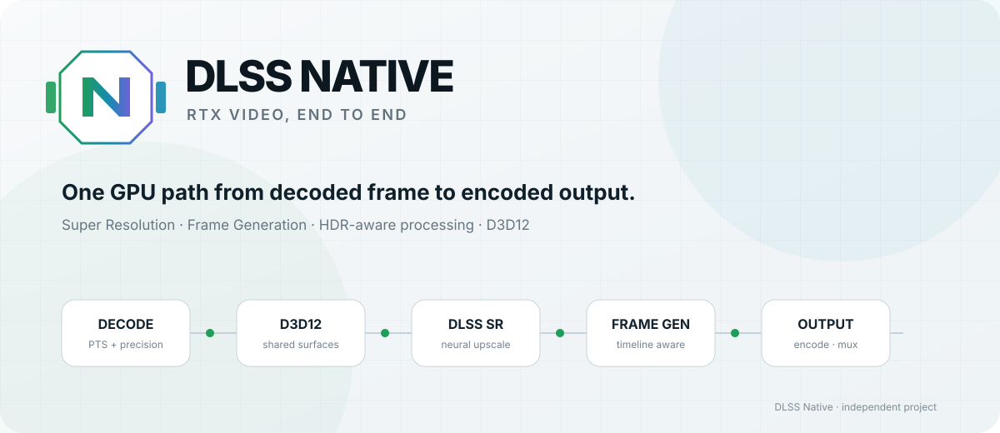
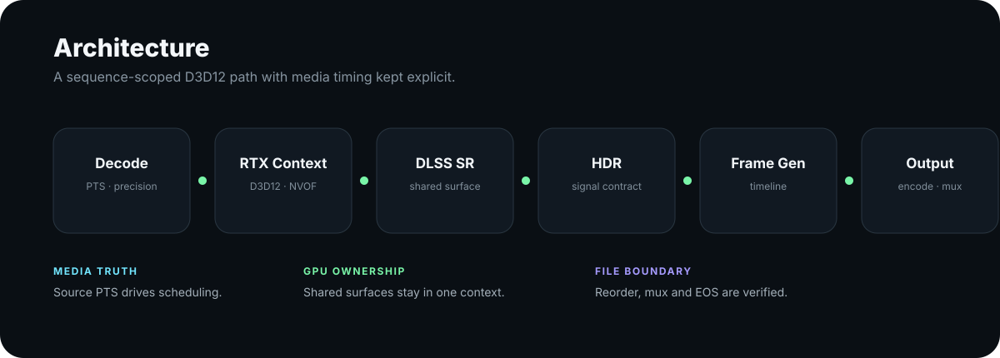
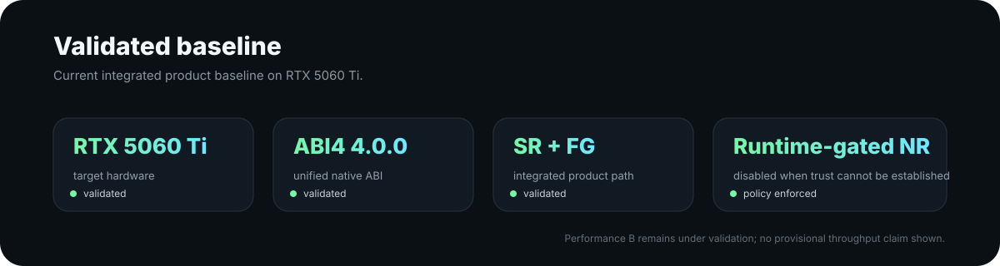

  <a href="https://z13321812367-sys.github.io/DLSS-Native/">
    <picture>
      <source media="(prefers-color-scheme: dark)" srcset="./docs/assets/hero-dark.svg">
      <source media="(prefers-color-scheme: light)" srcset="./docs/assets/hero-light.svg">
      
    </picture>
  </a>

<h3 align="center">面向 Super Resolution、Frame Generation 和 HDR 工作流的原生 RTX 视频处理管线。</h3>

  <a href="https://z13321812367-sys.github.io/DLSS-Native/">项目主页</a>
  ·
  <a href="./README.md">English</a>
  ·
  <a href="./THIRD_PARTY_NOTICES.md">第三方声明</a>

  Windows · NVIDIA RTX · D3D12 · Unified ABI4

---

## 它做什么

DLSS Native 是一个面向 Windows 的视频处理项目，把源视频时间轴、GPU 处理和最终输出调度放在同一条 D3D12 管线里。

当前设计用于：

- 使用 **DLSS Super Resolution** 放大视频；
- 使用 **DLSS Frame Generation** 生成中间帧；
- 在处理链中保持 **HDR 精度和信号语义**；
- 让调度始终跟随真实 frame PTS；
- 将编码、帧重排、mux 和最终验证作为同一条视频工作流的一部分处理。

目标很直接：使用 RTX 能力，同时避免把整条视频路径拆成大量不必要的 CPU 往返和松散转换步骤。

## 架构

  

Runtime 统一管理所选 GPU、D3D12 device、queue、feature session、光流 session 和共享 surface，并按视频序列维护同一个执行上下文。

这主要解决三个问题：

**减少 CPU 往返。** 神经处理阶段之间可以直接交换原生 GPU surface，不必让每一步都回到 host memory。

**保持正确的视频时间轴。** 调度以真实 frame PTS 和实际解码结果为准。源视频已经提供时间戳时，不再用平均帧率替代媒体时间。

**在文件边界验证输出。** 编码、帧重排、mux 和 EOS drain 都属于视频路径的一部分，不能只靠一次 GPU 调用成功来判断最终文件正确。

## HDR 不只是元数据

DLSS Native 把 HDR 当作图像信号处理问题。精度、transfer semantics 和处理域需要在整条管线里保持一致。

输出文件带有 BT.2020 / ST2084 标记，并不能单独证明中间处理没有破坏 HDR 信号。

## 已验证基线

  

当前集成基线已在 **RTX 5060 Ti** 上完成验证，使用 Unified **ABI4 4.0.0** runtime 和当前 SR / FG 产品路径。

Direct **D3D12 → NVENC** 仍在进行性能验证。吞吐数字会在当前验证线完成并能够复现后再公开。

## 当前状态

| 范围 | 状态 |
| --- | --- |
| DLSS Super Resolution | **当前产品路径可用** |
| DLSS Frame Generation | **当前产品路径可用** |
| Unified ABI4 / D3D12 runtime | **当前架构** |
| HDR-aware 视频管线 | **当前架构** |
| Neural Rendering / NR | **依赖可信 runtime；不可用时默认关闭** |
| Direct D3D12 → NVENC | **正在进行性能验证** |
| 公开应用源码 / 二进制 | **尚未发布** |

## Runtime 原则

NVIDIA feature runtime 需要来自合法、授权的 NVIDIA 来源，并在使用前进行检查。DLSS Native 不分发从游戏提取的 runtime、驱动内部 payload，也不复用第三方 NVIDIA Project/Application ID。

## License 与来源

Standalone Visual Enhancer 源线来自项目 provenance 中记录的 MIT-licensed `Merserk/dlss5-visual-enhancer` snapshot，随后加入 Unified Core / ABI4 架构工作。

具体见 [LICENSE](./LICENSE) 与 [THIRD_PARTY_NOTICES.md](./THIRD_PARTY_NOTICES.md)。

---

  DLSS Native 是独立项目，与 NVIDIA 无隶属或官方背书关系。 
  NVIDIA、GeForce RTX 与 DLSS 是 NVIDIA Corporation 的商标。

